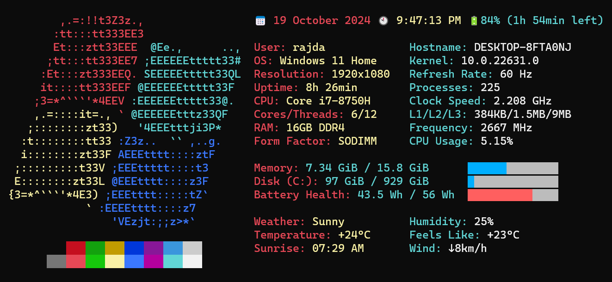

# Winfetch-Pro

Winfetch-Pro is an enhanced version of [Winfetch](https://github.com/lptstr/winfetch), designed to provide more functionality and customization for displaying system information in Windows. 

## Feature Overview

For more details on these features, please visit the [wiki](https://github.com/LunarEclipseCode/winfetch-pro/wiki) page.

- **Double Column Layout Supported**: Display information in either single or double columns to maximize readability and organization.

- **Header and Footer**: Add customizable headers and footers above and below the column layout.

- **Info Under Logo**: System information shown in the left or right column can also be placed below the logo. If the bottom section's length exceeds the length of the logo, the logo will be centered with respect to the bottom section by default.

- **Mini Functions**: To fit information in the double column layout, compact versions of functions are available to prevent info getting cut off in double column mode.

### Visual Customization

- **Alternate Percent Bar**: Choose from alternate style for the percentage bars to match your preferred aesthetic.

- **Auto-align Text and Bar**: Automatically aligns percent bars with text for a consistent and symmetric look.

- **Easy Coloring Options**: Easily customize the color of the Windows logo, as well as keys and values in different sections to view system info in your preferred theme.

- **Alternate Logo**: Added alternate logos for Windows 10 and 11.

- **Colorbar Centering**: Center the color bar for a cleaner, more symmetric layout.

### Extended System Information

Winfetch-Pro adds a range of functions to display more detailed system information:

- **WiFi**
- **Bluetooth**
- **Terminal Font** (Supports PowerShell and VS Code)
- **L1/L2/L3 Cache Information**
- **BIOS Information**
- **Battery Health**
- **Screen Refresh Rate**

#### More: \[[Installation](https://github.com/LunarEclipseCode/winfetch-pro/wiki/Installation)\] \[[Configuration](https://github.com/LunarEclipseCode/winfetch-pro/wiki/Configuration)\] \[[Colors](https://github.com/LunarEclipseCode/winfetch-pro/wiki/ANSI-Colors)\]
